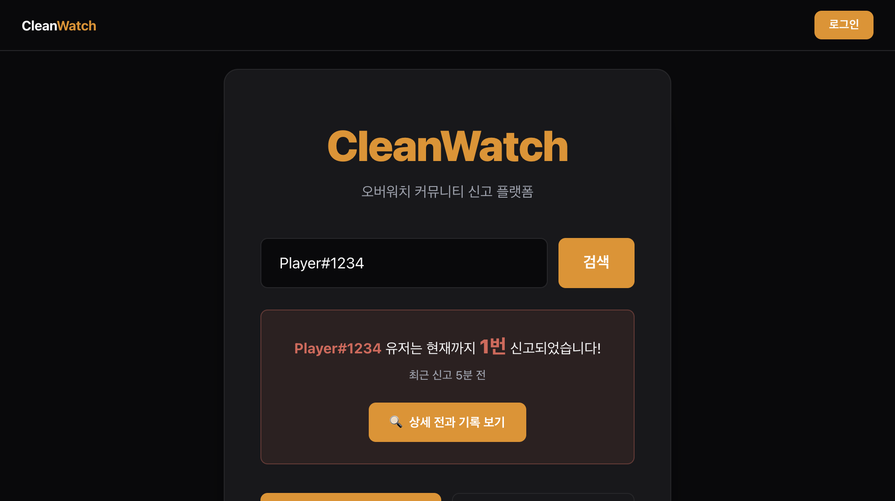

# 🚨 CleanWatch (오버워치 커뮤니티 신고 플랫폼)

> 오버워치 유저들의 건전한 게임 환경을 위한 배틀태그 기반 악성 유저 신고 및 전적 조회 서비스입니다.

### 🔗 [cleanwatch.cloud](https://cleanwatch.cloud)



<br>

## 🎮 주요 기능

- 🔥 **배틀태그 전과 조회** — 검색 한 번으로 누적 신고 횟수와 사유를 확인
- **신고 접수** — 카테고리별 신고. 중복 검사와 카운트 갱신을 서버 트랜잭션으로 묶음
- **재신고** — 같은 태그를 24시간에 1회. 공개 횟수는 "몇 명"이라 카운트는 오르지 않음
- **최근 신고 시점** — `3회 · 최근 2일 전`
- **오버워치 전적 연동** — 프로필·경쟁전 티어. 등록 시 배틀태그 실존 확인
- **디스코드 로그인** — OAuth2. 인가 코드 교환은 서버에서, `state`로 CSRF 방어
- **마이페이지 · 관리자 대시보드** — 내 신고 내역·프로필 설정, 신고 열람·삭제

<br>

## 🛠 기술 스택 및 API

**Frontend**


**Backend & Infra**


Firebase Authentication · Cloud Firestore · **App Check** · Admin SDK ·
Vercel Serverless Functions · 푸시마다 린트·타입체크·빌드, 배포 후 실제 엔드포인트를 때리는 스모크 테스트

**3rd Party**


- **OverFast API** — 오버워치 프로필·경쟁전 티어 조회. 서버리스 함수를 통해서만 호출합니다
- **Discord OAuth2** — 소셜 로그인. 토큰 교환은 서버에서 처리합니다
- **Cloudflare Turnstile** — 회원가입·비밀번호 재설정 봇 방어
- **Sonner** — 토스트 알림. 화면을 막고 맥락을 지우는 `alert()`를 전부 걷어냈습니다

<br>

## 🧭 설계 결정

기능보다 **판단**이 필요했던 것들입니다.

**공개되는 신고 횟수는 "몇 건"이 아니라 "몇 명"입니다.**
같은 사람을 또 만났을 때 기록할 수 있어야 하므로 재신고는 24시간에 1회 허용하되,
카운트는 첫 신고에만 올립니다. 한 사람이 반복해서 숫자를 부풀릴 수 있으면 **실명에
가까운 배틀태그에 붙는 그 숫자가 근거를 잃기** 때문입니다. 삭제도 같은 원칙이라,
그 사람의 마지막 한 건이 지워질 때만 차감합니다.

**배틀태그 실존 확인은 막지 않고 경고만 합니다.**
오버워치는 **비공개 프로필도 404**를 냅니다. 거부하면 비공개 사용자는 자기 진짜
배틀태그를 아예 등록할 수 없습니다. 서버도 "없음"을 404가 아닌 **200 `{ exists: false }`**
로 내려, 클라이언트가 "확실히 없다"와 "못 물어봤다"를 구분하게 했습니다. 상류가
죽었다고 가입이 막히면 안 되니까요.

**실패는 뭉치지 않고 갈라서 안내합니다.**
토큰 없음 / 권한 없음 / 상류 장애 / 상류 없음이 각각 다른 상태 코드와 문구로
내려갑니다. 하나로 뭉치면 "잠시 후 다시 시도"라는 누구에게도 도움이 안 되는 안내만
남습니다.

<br>

## 📂 아키텍처 (Architecture)

```text
📦 project-root
├── 📂 api/                  # Vercel Serverless Functions — DB 쓰기와 외부 API 호출을 전담
│   ├── 📂 _lib/             #   공용: Admin SDK·토큰 검증·OverFast 클라이언트·uid별 쓰로틀
│   ├── 📂 auth/discord/     #   OAuth 인가·콜백 (토큰 교환, 커스텀 토큰 발급)
│   ├── 📂 reports/          #   신고 접수·삭제 (중복 검사 + 카운트 갱신을 트랜잭션으로)
│   ├── 📂 stats/            #   OverFast 프록시 (본인 전적 조회 · 배틀태그 실존 확인)
│   ├── 📂 users/            #   닉네임·배틀태그 중복 검사
│   └── 📂 account/          #   회원 탈퇴 (신고 익명화 → 문서 삭제 → 계정 삭제)
├── 📂 src/                  # 프론트엔드 (React + TS)
│   ├── 📂 api/              #   통신 계층. 인터셉터가 ID 토큰을 자동으로 첨부
│   ├── 📂 pages/            #   화면 단위. 로직은 페이지별 hooks/로 분리
│   ├── 📂 components/       #   공용 UI (common/) · 머리말·꼬리말 (Layout/)
│   ├── 📂 hooks/queries/    #   React Query 훅 (서버 상태)
│   ├── 📂 store/            #   Zustand (클라이언트 전역 상태)
│   └── 📂 router/           #   AsyncBoundary 기반 에러/서스펜스 처리
├── 📄 firestore.rules       # 보안 규칙 (버전 관리 대상)
└── 📄 vercel.json           # 배포 설정 (보안 헤더)
```

**왜 쓰기를 서버로 몰았나** — 브라우저에서 Firestore를 직접 쓰면, 보안 규칙이 유일한
방어선이 됩니다. 그런데 규칙은 **문서 하나만** 보기 때문에 "이 쓰기가 중복 검사를 거쳤는지",
"짝이 되는 문서가 함께 생겼는지"를 표현할 수 없습니다.

그래서 여러 문서에 걸치거나 선행 검사가 필요한 작업은 전부 `api/`로 옮기고,
클라이언트 쓰기는 규칙에서 차단했습니다. 서버는 Admin SDK를 쓰므로 규칙을 우회합니다.

## 🔒 보안 설계

세 겹이 각각 다른 질문에 답합니다. 하나로는 못 막는 것들이 있어서 겹쳤습니다.

| 층                 | 확인하는 것       | 구현                                                             |
| ------------------ | ----------------- | ---------------------------------------------------------------- |
| **Firestore 규칙** | **누가** 요청했나 | 기본 전체 차단. 본인 문서만 읽기·수정, `role` 자가 승격 차단     |
| **서버 이관**      | 검사를 **거쳤나** | 중복 검사와 쓰기를 한 트랜잭션으로. `uid`는 검증된 ID 토큰에서만 |
| **App Check**      | **어디서** 왔나   | reCAPTCHA v3로 앱 증명. Firestore와 Auth 모두 적용               |

**규칙만으로 부족한 이유** — 정상 로그인한 사용자가 정상적인 형태의 쓰기를 반복하는 것은
규칙 입장에서 전부 합법입니다. 그래서 순서와 짝을 강제하는 일은 서버가, 요청 출처를
가리는 일은 App Check가 맡습니다.

그 밖에:

- 인증 상태에 따라 갈리는 실패(토큰 없음 / 권한 없음 / 상류 장애 / 상류 없음)는
  **서로 다른 상태 코드와 문구**로 내려보냅니다. 하나로 뭉치면 "잠시 후 다시 시도"라는
  누구에게도 도움이 안 되는 안내만 남습니다
- 브라우저에 노출되는 공개값(Firebase 웹 설정, 사이트 키)과 진짜 비밀(Admin SDK 개인 키,
  OAuth 시크릿)을 분리해 관리합니다. `.env.example`에 어느 쪽인지 명시해 두었습니다
- 응답 헤더로 `X-Frame-Options: DENY`(피싱용 iframe 삽입 차단)와
  `X-Content-Type-Options: nosniff`(MIME 스니핑 차단)를 내려보냅니다 — `vercel.json`
- **CSP**로 스크립트·이미지·통신 출처를 허용 목록으로 제한합니다. 정책은 코드에서
  유추하지 않고 **프로덕션에서 실제로 나가는 요청을 잡아** 만들었고, `Report-Only`로
  먼저 배포해 전 경로에서 위반 0을 확인한 뒤 강제로 전환했습니다
- 배틀태그를 본문으로 받는 `/api/stats/verify`에는 **uid별 쓰로틀**(10분 10회)을
  걸었습니다. 상류의 레이트 리밋은 호출자 IP 기준인데 **그 IP가 우리 서버**라,
  한 명이 긁으면 모든 사용자의 전적 조회가 같이 막힙니다

## 👥 팀원 역할 분담

| GitHub                                                 | 역할                                                                                                     |
| ------------------------------------------------------ | -------------------------------------------------------------------------------------------------------- |
| **[@pandemoniummm](https://github.com/pandemoniummm)** | **프론트엔드 리드 · 아키텍처 총괄**<br>TypeScript 이주 · 보안 아키텍처 재설계 · 신고 데이터 신뢰성 · CSP |
| [@Ryanghyeon](https://github.com/Ryanghyeon)           | 백엔드/인프라 초기 세팅 — Admin SDK 구조, OAuth 콜백 라우팅, Vercel 초기 배포                            |
| [@ininin0423](https://github.com/ininin0423)           | 프론트엔드 UI 서포트 · 보안 설정 보조 — 초기 UI 컴포넌트, App Check 연동                                 |

작업 이력과 **판단 근거는 PR에 있습니다.** 문서로 옮겨 적으면 한쪽만 낡습니다.

- [#1~#3](https://github.com/CleanWatch/Clean.Watch/pull/2) 레거시 JS → TypeScript 이주, 보안 아키텍처 재설계
- [#5~#8](https://github.com/CleanWatch/Clean.Watch/pull/8) 전적 연동 · Discord OAuth · 스모크 테스트 · 커스텀 도메인
- [#9~#11](https://github.com/CleanWatch/Clean.Watch/pull/11) 에러 화면 · 토스트 · 헤더 · 브랜드 자산
- [#12~#18](https://github.com/CleanWatch/Clean.Watch/pull/18) 신고 데이터 신뢰성 · 배틀태그 실존 확인 · CSP
